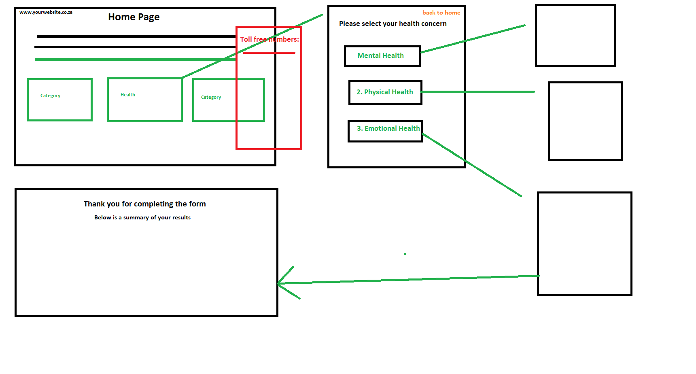
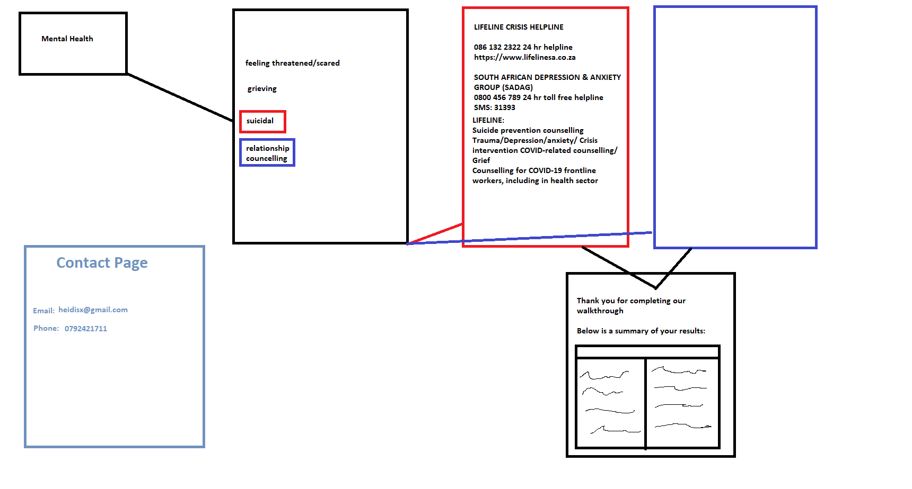

# psychosocial-pages

### Built during a 1 day Hackathon by Open Data Day Hackathon hosted by Codebridge & Front-end Development South Africa (FEDSA).

The topic was using technology for social good in South Africa.

https://www.meetup.com/fedsa-community/events/276476297/?comment_table_id=268307494&comment_table_name=reply

---

Link to webapp: https://wnortier.github.io/psychosocial-pages/

Planning:

